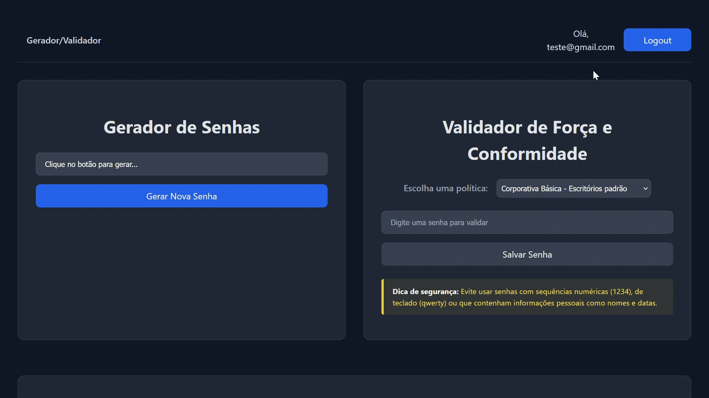

# Gerador e Validador de Senhas

Este projeto consiste em uma aplicação web full-stack, desenvolvida com um forte foco em segurança da informação, para a geração e validação de senhas seguras.A solução final permite que usuários se cadastrem e façam login em contas pessoais para utilizar um conjunto de ferramentas avançadas, que analisam a robustez de senhas existentes através de múltiplos critérios, como verificação em vazamentos de dados, análise de padrões e conformidade com políticas customizáveis.

## Demonstração Visual

<table>
  <tr>
    <td align="center">
      <strong>Fluxo da Tela Principal</strong>  
      
    </td>
  </tr>
</table>

## Funcionalidades Implementadas

As principais funcionalidades do sistema são:

### 1. Gerenciamento de Usuários e Autenticação
* **Cadastro e Login Seguros:** Usuários podem criar contas usando e-mail e senha. O sistema garante que as senhas de login sejam armazenadas de forma segura, utilizando hashing BCrypt. 
* **Autenticação por Token (JWT):** Após o login, o sistema utiliza JSON Web Tokens (JWT) para gerenciar a sessão do usuário de forma moderna e segura, garantindo que apenas usuários autenticados possam acessar funcionalidades restritas. 

### 2. Gerador de Senhas
* **Geração Customizável:** A ferramenta é capaz de gerar senhas fortes e aleatórias. 
* **Baseado em Políticas:** A geração segue as regras de "Políticas de Segurança" pré-definidas (ex: Corporativa, Bancária), garantindo que as senhas criadas atendam a requisitos específicos de complexidade. 

### 3. Validador de Força Inteligente
* **Análise Multi-fatorial:** O validador realiza uma análise completa, calculando uma pontuação de força e a **entropia em bits** da senha. 
* **Verificação de Vazamentos:** O sistema se conecta de forma segura à API "Have I Been Pwned?" para verificar se a senha inserida já foi exposta em algum vazamento de dados na internet. 
* **Análise de Padrões:** A ferramenta detecta e penaliza o uso de alguns padrões fracos, como sequências de teclado e caracteres repetidos.
* **Conformidade com Políticas:** O validador também verifica se a senha está de acordo com as regras da política de segurança selecionada pelo usuário. 

### 4. Histórico e Armazenamento Seguro
* **Histórico Pessoal por Usuário:** Todas as senhas geradas por um usuário logado são salvas em seu histórico pessoal, de forma isolada e privada. 
* **Autenticação de Segundo Fator:** O acesso ao histórico é protegido por uma segunda camada de segurança, exigindo uma senha dedicada.
* **Criptografia em Repouso (AES):** As senhas salvas no histórico são **criptografadas com o algoritmo AES** antes de serem armazenadas no banco de dados, garantindo a confidencialidade dos dados. 

### 5. Segurança da Aplicação
* **Comunicação Criptografada (HTTPS):** Toda a comunicação entre o frontend e o backend é protegida com HTTPS. 
* **Gerenciamento de Segredos:** Todas as credenciais sensíveis (senhas de banco de dados, chaves secretas) são mantidas fora do repositório do Git.

## Tecnologias Utilizadas

* **Backend:** Java 17, Spring Boot 3, Spring Security, Spring Data JPA.
* **Frontend:** React, Vite.
* **Banco de Dados:** PostgreSQL.
* **Versionamento:** Git & GitHub.

## Estrutura do Projeto

O projeto é organizado em uma arquitetura full-stack, com duas pastas principais na raiz: `frontend` e `gerador-senhas-api`.

### Backend (`gerador-senhas-api`)
* `src/main/java/br/com/lucas/gerador_senhas_api/`
  * **`config/`**: Classes de configuração do Spring, como o `SecurityConfig`.
  * **`controller/`**: Define os endpoints da API.
  * **`service/`**: Contém a lógica de negócio principal.
  * **`repository/`**: Interfaces do Spring Data JPA para acesso ao banco de dados.
  * **`model/`**: Classes de Entidade (`@Entity`) que mapeiam as tabelas.
  * **`policy/`**: Implementa o sistema de regras e políticas customizáveis.
  * **`filter/`**: Contém o `JwtAuthFilter` para validar tokens.
  * **`crypto/`**: Responsável pela lógica de criptografia dos dados.
  * **`dto/`**: Classes para transportar dados entre as camadas.
* `src/main/resources/`
  * `application.properties`: Configurações gerais.
  * `application-secrets.properties`: **(Ignorado pelo Git)** Armazena dados sensíveis.

### Frontend (`frontend`)
* `src/`
  * **`pages/`**: Componentes React que representam uma página inteira.
  * **`components/`**: Componentes React menores e reutilizáveis.
  * **`context/`**: Contém o `AuthContext` para gerenciamento de estado de autenticação.
  * **`hooks/`**: Hooks customizados, como o `useAuthFetch`.
  * **`router/`**: Contém a lógica de roteamento protegido (`ProtectedRoute`).
  * `main.jsx`: Ponto de entrada da aplicação e configuração do roteador.
* `vite.config.js`: Arquivo de configuração do Vite (HTTPS e proxy).

## Como Executar o Projeto

Este é um projeto full-stack com dois componentes que precisam ser executados separadamente.

### Backend (Porta 8443)
1.  Navegue até a pasta `gerador-senhas-api`.
2.  Certifique-se de ter um arquivo `application-secrets.properties` dentro de `src/main/resources` com as credenciais do seu banco de dados, do keystore e da chave secreta do JWT.
3.  Execute a aplicação através da classe principal `GeradorSenhasApiApplication.java` no IntelliJ.

### Frontend (Porta 5173)
1.  Navegue até a pasta `frontend` via terminal.
2.  Execute `npm install` para instalar as dependências.
3.  Execute `npm run dev` para iniciar o servidor de desenvolvimento.
4.  Acesse `https://localhost:5173` no seu navegador (lembre-se de aceitar o certificado autoassinado).

